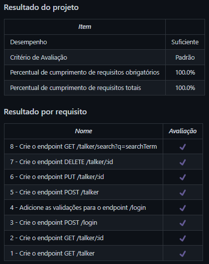

# Talker Manager
Projeto da [Trybe](https://www.betrybe.com/) - Bloco 22 - API para gestão de palestrantes feita em Node.js.

## 💻 Projeto

Aplicação de cadastro de talkers (palestrantes) em que é possível cadastrar, visualizar, pesquisar, editar e excluir informações.

<details>
  <summary><strong>🏆 Meu desempenho</strong></summary><br />

  
</details>

## 🚀 Tecnologias
> Este projeto foi desenvolvido com as seguintes tecnologias:

- Node.js
- Docker

## 📌 Habilidades

> Neste projeto, desenvolvi as seguintes habilidades:

- Desenvolver uma API de um CRUD (Create, Read, Update e Delete);
- Desenvolver endpoints para ler e escrever em um arquivo utilizando o módulo `fs`.

## ⬇️ Instalando dependências

```bash
npm install
``` 

## ⚡ Executando a aplicação

```bash
npm start
``` 

## 🧪 Executando os testes

```bash
npm test
```

## 💬 Contatos

<div align="center" style="display: inline_block">
  <a href="https://julianoboese.github.io" target="_blank"></a> 
  <a href="https://www.linkedin.com/in/julianoboese" target="_blank"></a> 
  <a href = "mailto:juliano.boese@gmail.com"></a>
</div>

<!-- ## 📄 Licença

Esse projeto está sob licença. Veja o arquivo [LICENÇA](LICENSE.md) para mais detalhes.

[⬆ Voltar ao topo](#nome-do-projeto)<br> -->
